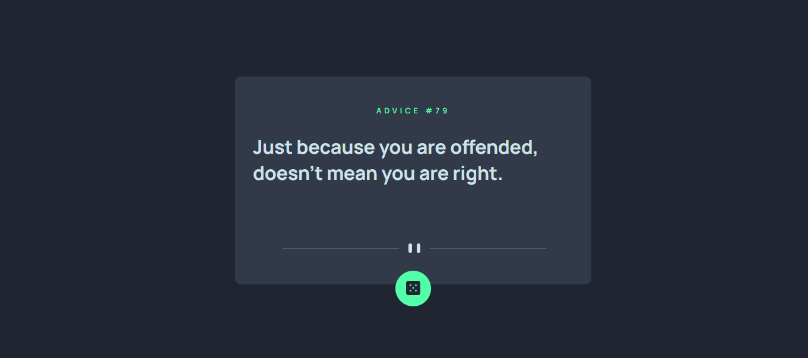

# Advice-Generator

> Este projeto foi desenvolvido baseado em um desafio do https://www.frontendmentor.io/challenges. Eu realizei a criação de um gerador de advices utilizando HTML, CSS e JAVASCRIPT

### Acesse o meu projeto

https://generator-advices.netlify.app/

### Ajustes e melhorias

O Projeto será refeito em REACT JS futuramente quando eu começar a ter contato com esse framework.

